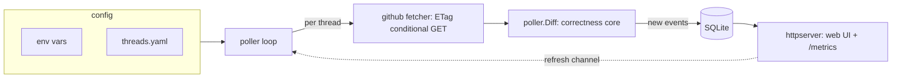

# threadwatch

Self-hosted Kubernetes monitor for GitHub issues and PRs you care about.

`threadwatch` polls a configured list of GitHub threads on a schedule, stores
their state in SQLite, and surfaces new activity (comments, reviews, state
changes) in a small web UI. The intended audience is anyone who maintains a
handful of open-source contributions in flight and wants to skip the daily
"any updates?" round trip.

## Status

Alpha. **Checkpoints A–C are complete** and running on k3s: it boots with
`/healthz` + `/readyz`, stores thread state in SQLite, polls GitHub on a
schedule (ETag conditional requests), and renders the event timeline alongside
Prometheus metrics. A multi-arch image and Helm chart ship from CI.

Hardening is in progress (lint / vulnerability scan / image signing / release
plumbing — see `CHANGELOG.md`). The first tagged release (`v0.1.0`) and the
OCI-published chart are pending.

## Why

- Watching ten OSS contribution threads by hand wastes a few minutes a day on
  a notification firehose that's mostly empty. Polling on a server lets you
  skip the empty days entirely.
- Surfacing activity in one place beats per-repo notifications when you only
  care about the threads you're personally engaged in.

## Architecture



The poller drives everything on a timer (and on demand via the refresh
channel): for each watched thread it fetches from GitHub with conditional
requests, diffs the result against stored state, and persists only the new
events. The HTTP server reads that state for the UI and exposes metrics.

<!-- Screenshots live in docs/screenshots/ — see that directory's README. -->

## Quick start (when V1 is shipped)

```bash
helm install threadwatch \
  oci://ghcr.io/jasondillingham/charts/threadwatch \
  --version 0.1.0 \
  -f my-values.yaml
```

See `charts/threadwatch/README.md` for the values reference.

## Local development

```bash
make run         # go run ./cmd/threadwatch
make test        # go test ./... -race
make docker      # build the image as ghcr.io/jasondillingham/threadwatch:dev
make helm-lint   # lint the chart
```

## Design decisions worth knowing

- **SQLite (not Postgres)**. One writer (the poller) and many readers (HTTP
  handlers) is SQLite's sweet spot. The data volume is tiny (events for ten
  threads over months). One container, one file, no DB operator to run.
- **In-process poller (not a CronJob)**. Shared logger, shared connection
  pool, and `POST /api/threads/refresh` is just a channel send rather than
  a Kubernetes API call. The trade-off is that the poller and web share a
  failure domain; the poller goroutine has its own recovery to keep
  `/healthz` honest.
- **htmx + server-rendered Tailwind (not an SPA)**. The UI is a table and a
  timeline; both are fundamentally request-response. No JS framework version
  treadmill.
- **REST + ETag conditional requests (not GraphQL)**. With ETags, ~80% of
  polls return 304 and don't count against the GitHub rate budget. Simpler
  to explain in interviews than GraphQL pagination semantics.

## License

[Apache 2.0](LICENSE).
